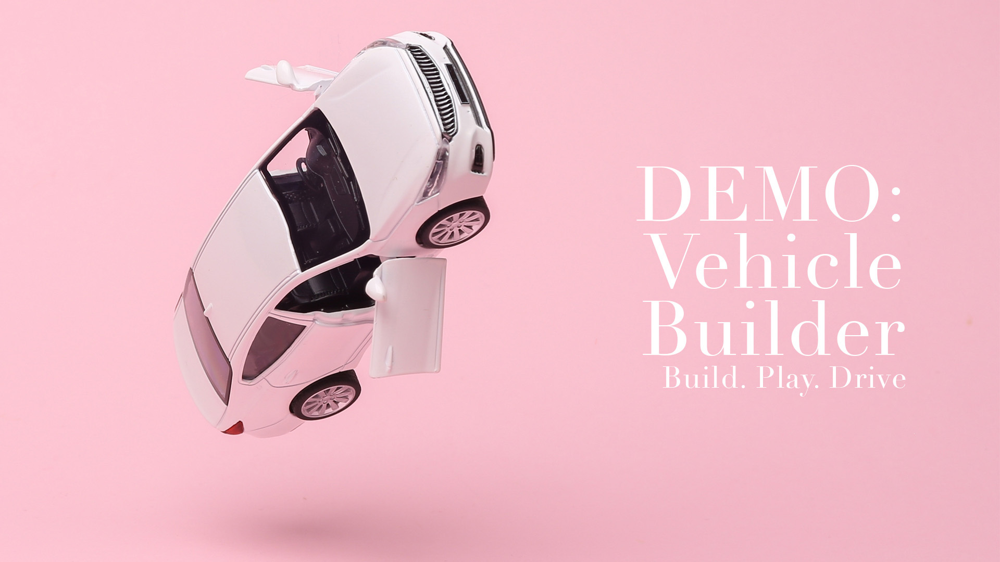

# Vehicle Builder in the Command Line


## Table of Contents
- [Description](#description)
- [Installation](#installation)
- [Usage](#usage)
- [License](#license)
- [Contributing](#contributing)
- [Tests](#tests)
- [Questions](#questions)

## Description
Created a command line interface application to build a vehicle, either a car, truck or motorbike. Once your vehicle has been built, you can perform a game to choose actions for your vehicle, such as start the vehicle, accelerate by 5 mph, or turn right.

## Installation
To install the necessary dependencies, run the following command:

```
npm install
```

## Usage
To begin the program, and build your vehicle, run the following command:

```
npm start
```

Follow the prompts to enter project details such as Create Vehicle, Make, Model, etc.

### Demo Video
[](https://drive.google.com/file/d/1C4Dl9Dov71QbYZ5CS5oI8uznDgVbiT-C/view?usp=drive_link)

This demo shows the program's features, including creating a vehicle and playing a game, based on user inputs. Watch a demo by clicking the image above.


## License
This project is licensed under the [MIT](https://opensource.org/licenses/MIT) license.

## Contributing
If you'd like to contribute to this project, please fork the repository and submit a pull request. For any major changes, please open an issue first to discuss what you'd like to change.

## Tests
To run tests, use the following command:

```
npm test
```

## Questions
If you have any questions about the project, feel free to contact me:

- GitHub: [Elementary-my-dear-Watson](https://github.com/Elementary-my-dear-Watson)
- Email: marthacdenzer@gmail.com
